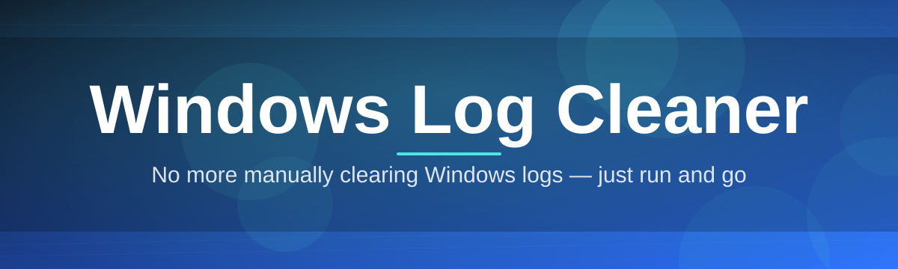

# windows-log-cleaner-utility

No more manually clearing Windows logs — just run and go

  

## Overview

No more manually clearing Windows logs — just run and go

## License

[MIT License](LICENSE)
